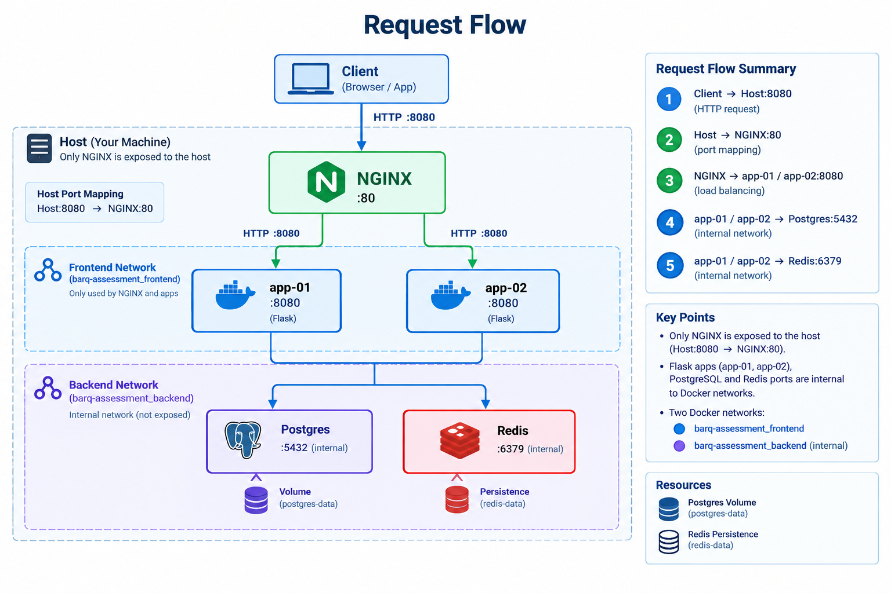

# DevOps Internship Task

A containerized Flask application deployed with Docker Compose, using NGINX as a reverse proxy and load balancer, with PostgreSQL and Redis as backend services.

The project includes automated validation, backend failure/recovery testing, database backup/restore, healthchecks, and GitHub Actions CI.

## Architecture

The application consists of:

- **nginx** — reverse proxy and load balancer
- **app-01** — Flask application instance
- **app-02** — Flask application instance
- **postgres** — PostgreSQL database
- **redis** — Redis service



## Prerequisites

Install:

- Git
- Docker
- Docker Compose
- Python 3

Verify:

```bash
git --version
docker --version
docker compose version
python3 --version
```

## Setup

Clone the repository:

```bash
git clone <REPOSITORY_URL>
cd barq-academy
```

Create the environment file:

```bash
cp .env.example .env
```

Edit `.env` and provide the required configuration:

```bash
nano .env
```

> **Important:** Do not commit `.env` to Git.

Verify:

```bash
git status
```

The `.env` file should not appear as a tracked file.

## Validate Docker Compose Configuration

Before starting the application:

```bash
docker compose config
```

This verifies that the Compose configuration is valid and that the required environment variables are available.

## Build

Build all application images:

```bash
docker compose build
```

To rebuild without using the Docker build cache:

```bash
docker compose build --no-cache
```


## Start

Start all services in detached mode:

```bash

docker compose up -d

```

Check the containers:

```bash

docker compose ps -a

```

Expected services:

- nginx

- app-01

- app-02

- postgres

- redis

Check logs:

```bash

docker compose logs

```

For a specific service:

```bash

docker compose logs nginx

docker compose logs app-01

docker compose logs app-02

docker compose logs postgres

docker compose logs redis

```

Follow logs in real time:

```bash

docker compose logs -f

```


## Check Health

Check container status:

```bash

docker compose ps

```

The application services should eventually report **healthy**.

You can also inspect individual containers:

```bash

docker inspect -f '{{.State.Health.Status}}' nginx

docker inspect -f '{{.State.Health.Status}}' app-01

docker inspect -f '{{.State.Health.Status}}' app-02

docker inspect -f '{{.State.Health.Status}}' postgres

docker inspect -f '{{.State.Health.Status}}' redis

```

Expected:

```text

healthy

```

Healthchecks are used because a container being **running** does not necessarily mean that the application inside it is ready to serve requests.


## Test the Application

The main validation script is:

```bash

python3 validate.py

```

It verifies:

- Container availability

- Container health

- Public access through NGINX

- `/health`

- `/ready`

- PostgreSQL readiness

- Redis readiness

- `/instance`

- `/records`

- `/counter`

- Traffic distribution between app-01 and app-02

A successful validation should end with no **FAIL** checks.

You can also verify the public endpoint manually:

Check the health endpoint:

```bash

curl http://localhost:8080/health

```

Check readiness:

```bash

curl http://localhost:8080/ready

```

Check the backend instance:

```bash

curl http://localhost:8080/instance

```


## Backend Load-Balancing Test

The validation script checks that both backend instances receive traffic.

Run:

```bash

python3 validate.py

```

The `/instance` endpoint is requested multiple times.

Example:

```text

Backend distribution:

app-01: 5

app-02: 5

```

The exact distribution is not expected to be perfectly equal because NGINX load balancing does not guarantee an exact 50/50 distribution for a small number of requests.

The important requirement is that **both backends are observed**.


## Backend Failure and Recovery Test

The failure test intentionally stops one backend and verifies that the remaining backend continues serving traffic.

Run:

```bash

python3 failure_test.py

```

The test performs:

1. Verify that app-01 and app-02 are running.
2. Send baseline traffic.
3. Stop app-01.
4. Verify that app-01 is stopped.
5. Verify that NGINX is still running.
6. Send traffic while app-01 is down.
7. Verify that app-02 serves requests.
8. Verify that the service remains available.
9. Restart app-01.
10. Wait until app-01 becomes healthy.
11. Send recovery traffic.
12. Verify that app-01 serves requests again.

Expected flow:

```text

app-01

|

X stopped

|

v

NGINX

|

v

app-02

|

v

Requests continue successfully

```

After recovery:

```text

app-01 → started → healthy → receives traffic again

```

This test demonstrates **backend-level resilience**.

> **Note:** This does not prove complete production high availability because NGINX and PostgreSQL can still be single points of failure.


## Database Backup

The database backup script is:

```bash

./backup.sh

```

If required, make the script executable:

```bash

chmod +x backup.sh

```

Then run:

```bash

./backup.sh

```

The script creates a PostgreSQL backup that can be used for restoration.

Verify the generated backup:

```bash

ls -lh

```


## Database Restore

Make the restore script executable:

```bash

chmod +x restore.sh

```

Run:

```bash

./restore.sh

```

After restoring, verify that the application is available:

```bash

python3 validate.py

```

The `/records` endpoint can be used to verify that persistent application data is still available after the backup/restore procedure.


## Stop Services

To stop the containers without removing them:

```bash

docker compose stop

```

To stop and remove the containers:

```bash

docker compose down

```

The persistent volumes are not removed by the normal `docker compose down` command.


## Cleanup

To remove containers and networks:

```bash

docker compose down

```

To remove containers, networks, and persistent volumes:

```bash

docker compose down -v

```

> **Warning:** `docker compose down -v` deletes the Docker volumes and therefore can delete persistent PostgreSQL/Redis data.

Use it only when a complete cleanup is required.

Optional cleanup of unused Docker resources:

```bash

docker system prune

```

Review the resources before confirming the prune operation.


## CI (Continuous Intergration)

GitHub Actions is configured to run on:

- Push

- Pull request

The CI workflow performs:

Checkout

   ↓

Create CI `.env`

   ↓

Python syntax checks

   ↓

Shell syntax checks

   ↓

Docker Compose validation

   ↓

Docker build

   ↓

Start services

   ↓

Wait for healthchecks

   ↓

Run `validate.py`

   ↓

Trivy security scan

   ↓

Cleanup

The CI environment uses GitHub Actions Secrets for PostgreSQL configuration.

Secrets are referenced through:

```text

CI_POSTGRES_USER

CI_POSTGRES_DB

CI_POSTGRES_PASSWORD

```

Secrets are not stored directly in the repository.

The Trivy image scan is currently configured as a **non-blocking security check** for the assessment.


## Validation and Design Rationale
**When should validation fail?**

Validation should fail whenever a required service or application behavior does not meet the expected condition.

The validation fails when, for example:

- A required container is not running.
- A required container is not healthy.
- NGINX cannot serve the public endpoint.
- /health or /ready fails.
- PostgreSQL or Redis is not ready.
- /instance does not return a valid backend.
- Both application instances cannot be reached through NGINX.
- Required /records or /counter functionality fails.
- Backend failure/recovery behavior does not meet the expected requirements.

**What does green CI prove?**

A green CI run proves that the tested repository configuration passed the automated checks in the CI environment, including Compose validation, image building, service healthchecks, application validation, and the configured security scan.

It does not prove that the system is completely bug-free or production-ready.

Green CI does not guarantee:

- Production-scale performance.
- Complete security.
- No unknown vulnerabilities.
- High availability of every component.
- Successful disaster recovery under every failure scenario.
- Availability of external dependencies.

Therefore, green CI means that the defined automated checks passed, not that every possible production failure has been eliminated.

**Request Flow and Network Design**

Requests enter through the only published host port:

Only NGINX is exposed to the host. The Flask applications, PostgreSQL, and Redis remain internal to the Docker networks.

The frontend network allows NGINX to communicate with the application instances. The backend network allows the application instances to communicate with PostgreSQL and Redis.

Service names are used instead of container IP addresses so that communication remains stable when containers are recreated.

Healthchecks are used because a container being running does not necessarily mean that the application inside it is ready to serve requests. CI therefore waits for all required services to become healthy before running functional validation.

**Timeouts, Retries, Restart Policies and Resource Limits**

Timeouts and retries prevent startup delays or unavailable services from causing tests to hang indefinitely.

The CI healthcheck wait allows services time to initialize while still enforcing a maximum wait period. HTTP validation also uses bounded request timeouts.

The unless-stopped restart policy allows services to recover from unexpected container failures while still respecting intentional shutdowns.

CPU and memory limits prevent a single container from consuming unlimited host resources.

These values are assessment/development defaults. Production values should be tuned using actual startup times, traffic patterns, resource usage, and service-level objectives.

**Remaining Single Points of Failure**

The current architecture provides redundancy at the Flask application layer because two backend instances are available. However, some single points of failure remain:

- A single NGINX container can prevent external access if it fails.
- A single Docker host can take down the complete stack.
- A single PostgreSQL instance can make database-dependent functionality unavailable.
- A single Redis instance can affect functionality that depends on Redis.
- Local storage can be lost if the Docker host or its storage fails.

For production, these could be improved with multiple NGINX/ingress replicas, multiple hosts or availability zones, highly available PostgreSQL and Redis, off-host backups, automated disaster recovery, and centralized monitoring and alerting.

## Ports and Networks

The public entry point is:

```text

localhost:8080

```

NGINX listens internally on:

```text

80

```

Only NGINX is published to the host.

The application, PostgreSQL, and Redis services communicate through Docker networks.

This reduces the externally exposed attack surface and prevents direct host access to internal services.


## Persistence

PostgreSQL uses persistent storage so that application data survives normal container recreation.

Redis persistence is also configured according to the Compose configuration.

However:

```bash

docker compose down -v

```

removes the volumes.

Therefore, production deployments should additionally use:

- Automated backups

- Off-host backup storage

- Backup retention policies

- Encryption

- Regular restore testing


## Troubleshooting

Investigation details, failed attempts, root causes, fixes, and retests are documented separately in:

[`troubleshooting.md`](troubleshooting.md)

Architecture and design decisions are documented in:

[`decisions.md`](decisions.md)

Security risks and improvements are documented in:

[`security_review.md`](security_review.md)

The log analysis and correlated evidence are documented in:

[`log_analysis.md`](log_analysis.md)
